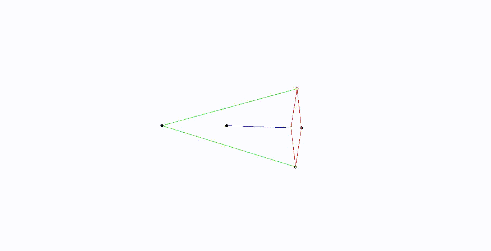

# Mechanical Peaucellier Mechanism Simulation
Simulation of Peaucellier Mechanism repository, using Opencv library to render simulation.

## Getting Started
This repository provides Simulation of Peaucellier Mechanism based C/C++ language.


### Prerequisites
  - SO -> Linux Ubuntu / Windows
  - Programming Language -> C/C++
  - LIB -> Opencv [Opencv Ubuntu instalation](https://www.learnopencv.com/install-opencv-3-4-4-on-ubuntu-16-04/) and [Opencv Windows 10 instalation](https://www.learnopencv.com/install-opencv3-on-windows/)

### Compile and run (Linux Ubuntu)
- Using the terminal enter in repository folder and type the command:
```c++
make
./peaucellier.o
```


### Compile and run (Windows)
- Using IDE to use C++ with Opencv and run main.cpp
