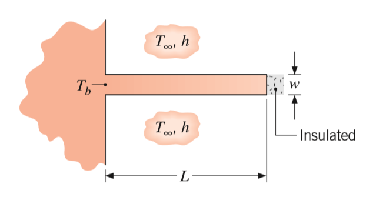
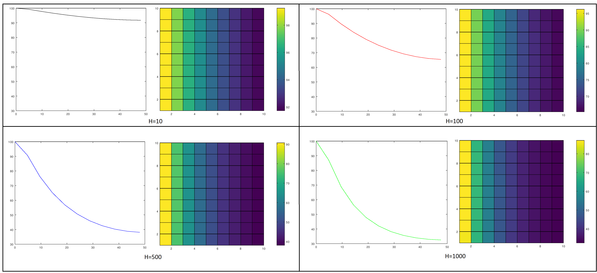

# Mechanical-Simulations

# Simulation of Heat Transfer in a Fin
(English) Simulation of Heat Transfer in a Fin, using finite volumes.
(PtBr) Simulação de transferência de calor em uma aleta, usando volumes finitos.

## Getting Started and Prerequisites
This repository provides Simulation of Heat Transfer in a Fin based on script programing language. This simulation was based on **question 78 of chapter 4, book Fundamentals of Heat and Mass Transfer Incropera 7ª ed**. The used programming Language, was script using [Octave](https://www.gnu.org/software/octave/) or MatLab.

## Obtained Results
Results that plot map of temperature that **blue is more cold** and **red is more hot** for diferent *heat transfer coefficients [W/(m2K)]*, axes *Y[cm]* and *X[cm]* represents a fin in 2D matrix.

